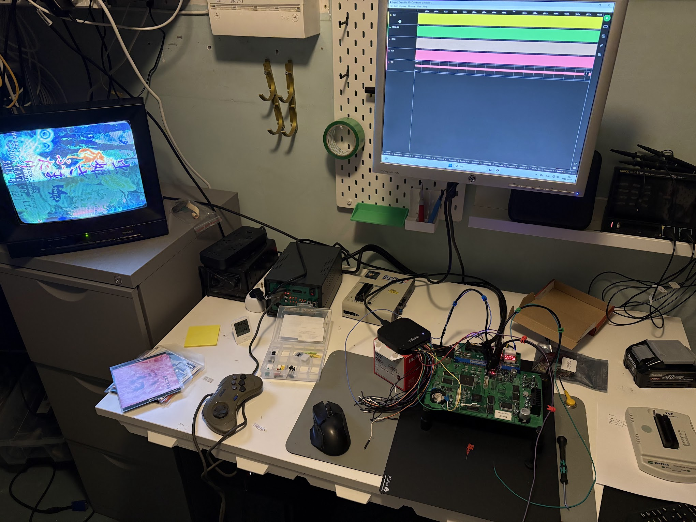

# Video Timings for CV1000

Since noone else has measured this properly?

## Results

Lines per frame: 262 (including sync)

- Empty lines before image: [11](pics/empty_lines_top_11.png)
- Active lines: [240](pics/active_lines_240.png)
- Empty lines after image: [8](pics/empty_lines_bottom_8.png)
- Lines of VSYNC: [3](pics/sync_3lines.png) 

[Pixels per line: 407 (including sync)](pics/full_line_3256_clk.png)

One pixel is drawn every 8 CLK pulses (6.4MHz). To get the pixels per area, divide CLK by 8 (or VRAM_CLK by 12).

- Empty area left : [42px](pics/overscan_left_336_clk.png)
- Active area: [320px](pics/active_drawing_area_2560_clk.png)
- Empty area right: [16px](pics/overscan_right_128_clk.png)
- HSYNC: [29px](pics/hsyncpulse_232_clk.png)

[A full frame is 853072 CLK pulses (106634 pixels).](pics/full_frame_853072_clk.png)

Game framerate is 60.0183806291HZ (51200000 / 853072).

## Test setup.

Measured on a Mushihimesama Futari 1.5 PCB with Vertical and Horizontal position set to 00 in test menu.

Measurements were taken during attract mode when the Cave logo with a white background is shown.

"Left/right/top/bottom" refers to a monitor in horizontal mode. This means that "left" will mean "bottom of screen" when monitor is rotated in TATE mode for vertical games.

Saleae Logic Pro 16 was used as Logic Analyzer. Digital sample rate 500MS/s. Analog sample rate 50 MS/s.

Probes were hooked up to:

- CLK (CKIO from SH3, 51.2Mhz): Pin 37 on U13
- VRAM_CLK (Blitter / Video RAM clock, 76.8Mhz): Pin 45 on U6
- SYNC (digital sync signal): Pin 17 of U11
- CLR (analog color signal): "Video Blue" on Jamma Edge

Each measurement has an image showing the Logic Analyzer output above.

Raw data is available in analysis/cv1000_2frames_video_timing.sal
